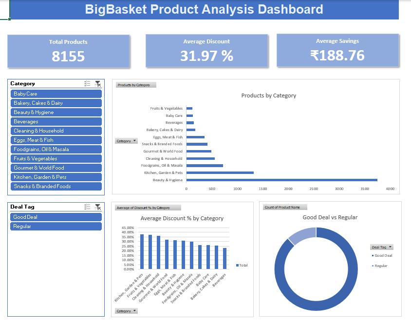
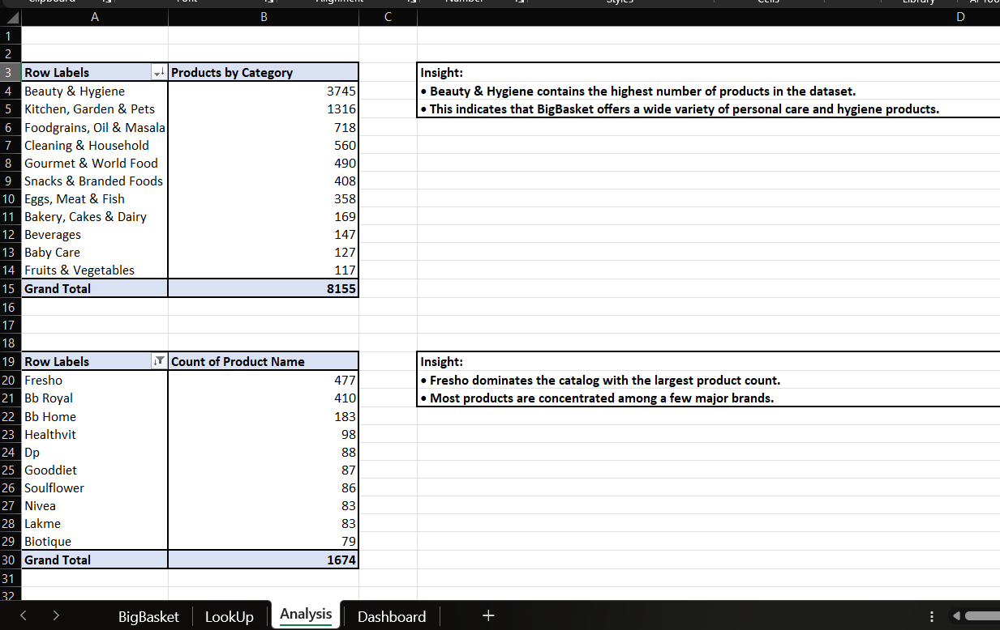

# 📊 BigBasket Product Analysis Dashboard

<div align="center">


**An end-to-end Excel data analysis project on BigBasket's product catalog — featuring data cleaning, advanced formulas, pivot analysis, and an interactive dashboard.**

</div>

---

## 📸 Dashboard Preview



---

## 📊 Analysis Preview



---

## 📌 Project Overview

BigBasket is India's largest online grocery platform. This project analyzes their product catalog of **8,155 products** across **11 categories** to uncover pricing trends, discount patterns, and product distribution insights.

This project was built entirely in **Microsoft Excel** — from raw data cleaning to an interactive dashboard with slicers and KPI cards.

---

## 🗂️ Project Structure

```
bigbasket-excel-dashboard/
│
├── BigBasket.xlsx        # Main Excel workbook
│   ├── BigBasket         # Raw dataset + data cleaning
│   ├── LookUp            # Structured reference tables
│   ├── Analysis          # Pivot tables + insights
│   └── Dashboard         # Interactive dashboard
│
├── dashboard.png         # Dashboard screenshot
├── analysis.png          # Analysis sheet screenshot
└── README.md             # Project documentation
```

---

## 🛠️ Tools & Excel Features Used

| Feature | Usage |
|---|---|
| Data Cleaning | Removed duplicates, handled blanks, formatted columns |
| Cell Referencing | Absolute and relative references across sheets |
| IF / IFERROR | Conditional logic and error handling |
| XLOOKUP | Dynamic product lookups in LookUp sheet |
| INDEX MATCH | Advanced lookups for flexible data retrieval |
| Pivot Tables | Summarized data by category, brand, deal type |
| Pivot Charts | Bar, column and donut charts |
| Slicers | Interactive filters by Category and Deal Tag |
| KPI Cards | Total Products, Avg Discount, Avg Savings |
| Conditional Formatting | Highlighted key values and trends |

---

## 📊 Dashboard Features

- **KPI Cards** — Total Products (8,155) · Average Discount (31.97%) · Average Savings (₹188.76)
- **Products by Category** — Horizontal bar chart showing product distribution
- **Average Discount % by Category** — Column chart showing discount trends
- **Good Deal vs Regular** — Donut chart showing deal tag split
- **Category Slicer** — Filter all visuals by product category
- **Deal Tag Slicer** — Filter by Good Deal or Regular

---

## 🔍 Key Insights

> **1. Beauty & Hygiene dominates the catalog**
> With 3,745 products it accounts for nearly 46% of all products on BigBasket.

> **2. Kitchen, Garden & Pets offers the highest discounts**
> Average discount of 38.10% — the most heavily discounted category.

> **3. 88% of products are tagged as Good Deal**
> BigBasket aggressively prices products to attract value-conscious customers.

> **4. Kitchen, Garden & Pets leads in average savings**
> Customers save an average of ₹295.04 per product in this category.

> **5. Top brand is Fresho with 477 products**
> BigBasket's own private label dominates the brand catalog.

---

## 📁 Dataset

- **Source:** [BigBasket Products Dataset — Kaggle](https://www.kaggle.com/datasets/chinmayshanbhag/big-basket-products)
- **Total Records:** 8,155 products
- **Columns:** Product Name, Category, Sub-Category, Brand, Sale Price, Market Price, Type, Rating

---

## 🚀 How to Use

1. Download `BigBasket.xlsx`
2. Open in **Microsoft Excel** (2016 or later recommended)
3. Navigate to the **Dashboard** sheet
4. Use the **Category slicer** to filter by product category
5. Use the **Deal Tag slicer** to filter by Good Deal or Regular
6. Explore the **Analysis** sheet for detailed pivot tables and insights
7. Explore the **LookUp** sheet for XLOOKUP and INDEX MATCH formulas

---

## 👤 Author

**Mohammad Ibrahim Khan**
Aspiring Cloud Data Analyst | Excel · SQL · Python · Power BI · GCP · Big Query · DBT 

[](https://github.com/ibrahimkhanmohammad)

---

<div align="center">
⭐ If you found this project helpful, consider giving it a star!
</div>
